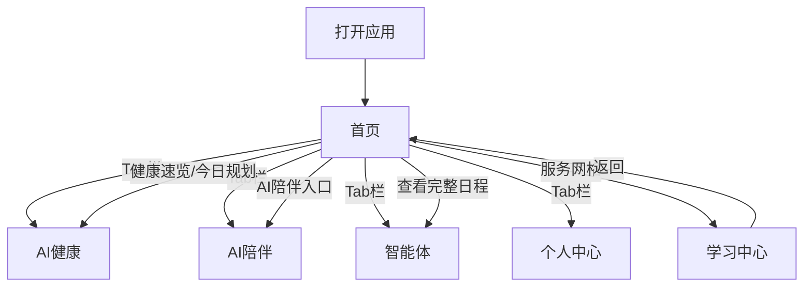

# 产品需求文档 — 生命树 AI（LifeTree AI）

## 1. 产品概述
生命树 AI 是一款面向老年用户的智慧生命管理平台移动端应用，集成 AI 健康、AI 陪伴、AI 智能体与学习中心四大核心服务，帮助老人进行健康监测、日常陪伴、生活代办与终身学习。
- 目标用户：60 岁以上老年人及其家庭
- 核心价值：一句话搞定生活大小事，全方位守护健康，随时温暖陪伴

## 2. 核心功能

### 2.2 功能模块
1. **首页**：问候横幅、健康速览、今日规划、服务入口网格、AI 陪伴快捷入口
2. **AI 健康页**：健康评分环、生命体征网格、风险评估、今日健康报告、用药提醒、健康小贴士
3. **AI 陪伴页**：数字人头像、聊天对话、陪伴广场、每日问候、心情记录、聊天输入栏
4. **智能体页**：语音输入（麦克风采光动画）、演示对话、常用功能快捷入口、今日日程时间线、小康能力介绍
5. **学习中心页**：学习分类网格、热门课程横滑卡片、老年课堂网格、直播课程、我的学习进度
6. **个人中心页**：用户资料卡、家庭关爱、功能菜单分组、界面模式切换、紧急联系

### 2.3 页面详情

| 页面名称 | 模块名称 | 功能描述 |
|----------|----------|----------|
| 首页 | 问候横幅 | 根据时段显示问候语、天气、日期 |
| 首页 | 健康速览 | 横向滚动展示心率/血压/步数卡片，点击跳转健康页 |
| 首页 | 今日规划 | 时间线展示当日事项，查看完整日程跳转智能体页 |
| 首页 | 服务入口 | 6 宫格服务卡片，点击跳转对应页面 |
| 首页 | AI 陪伴入口 | 脉冲动画卡片，点击跳转陪伴页 |
| AI 健康 | 健康评分 | SVG 环形进度动画展示评分 86/100，风险等级标签 |
| AI 健康 | 生命体征 | 2×2 网格展示心率/血压/血氧/体温，趋势状态 |
| AI 健康 | 风险评估 | 横向滚动卡片展示 8 项风险等级 |
| AI 健康 | 健康报告 | 文字报告与查看详情按钮 |
| AI 健康 | 用药提醒 | 用药列表、已服/待服状态、提醒开关 |
| AI 健康 | 健康小贴士 | 渐变卡片展示每日贴士 |
| AI 陪伴 | 数字人 | 脉冲动画头像、在线状态、问候气泡 |
| AI 陪伴 | 聊天对话 | AI/用户消息气泡，支持发送消息获得模拟回复 |
| AI 陪伴 | 陪伴广场 | 横向滚动 6 张活动卡片，直播标签 |
| AI 陪伴 | 每日问候 | 天气与生活建议卡片 |
| AI 陪伴 | 心情记录 | 5 种心情单选，选中高亮 |
| AI 陪伴 | 聊天输入栏 | 语音按钮、文本输入、发送按钮 |
| 智能体 | 语音输入 | 麦克风按钮 + 渐变环旋转 + 脉冲扩散动画 |
| 智能体 | 演示对话 | 用户/AI 气泡，AI 回复含逐条出现的行动清单 |
| 智能体 | 常用功能 | 3×2 快捷功能网格 |
| 智能体 | 今日日程 | 时间线展示 9 项日程，已完成/当前/待办状态 |
| 智能体 | 小康能力 | 2×2 能力卡片网格 |
| 学习中心 | 学习分类 | 4×3 分类网格 |
| 学习中心 | 热门课程 | 横向滚动 4 张课程卡片，渐变封面 |
| 学习中心 | 老年课堂 | 2×4 课堂网格 |
| 学习中心 | 直播中 | 直播课程列表，脉冲直播标签 |
| 学习中心 | 我的学习 | 进度条、连续学习天数、已学课程统计 |
| 个人中心 | 用户资料 | 头像、姓名、ID、健康评分与会员徽章 |
| 个人中心 | 家庭关爱 | 横向滚动家庭成员，在线状态、添加成员 |
| 个人中心 | 功能菜单 | 4 组菜单列表（健康/AI/服务/设置） |
| 个人中心 | 界面模式 | 横向滚动 6 种模式，单选切换 |
| 个人中心 | 紧急联系 | 紧急联系人信息、拨打按钮、SOS 按钮 |

## 3. 核心流程

用户打开应用进入首页，通过底部 Tab 栏在 5 个主页面间切换（首页/AI健康/AI陪伴/智能体/我的），首页服务网格与各处入口可跳转到对应功能页（如学习中心）。所有数据通过前端 mock 提供。

## 4. 用户界面设计

### 4.1 设计风格
- 主色：品牌绿 #5BB89E，辅色：蓝 #6FB1D9、金 #E8B87C
- 语义色：成功绿、警告金、错误红 #D46B6B、信息蓝
- 卡片风格：毛玻璃（backdrop-filter blur 8px + 半透明白底）
- 背景：暖白 #FBFAF8
- 字体：Outfit（标题）+ Lora（正文）+ 中文回退 PingFang SC
- 圆角：10/16/24px，胶囊 9999px
- 图标：Lucide 线性图标风格
- 布局：移动端单栏，最大宽度 430px 居中

### 4.2 页面设计概览

| 页面名称 | 模块名称 | UI 元素 |
|----------|----------|---------|
| 全局 | 顶部 Header | 品牌名+SOS按钮，毛玻璃固定 |
| 全局 | 底部 Tab 栏 | 5 个标签，激活态顶部绿色指示条 |
| 首页 | 问候横幅 | 渐变背景绿→蓝，大标题+副标题+日期 |
| 首页 | 健康速览 | 横滑卡片，图标+数值+单位 |
| AI 健康 | 评分环 | SVG 环形渐变填充动画 |
| AI 陪伴 | 数字人头像 | 渐变圆形+脉冲扩散动画 |
| 智能体 | 麦克风 | 渐变环旋转+三层脉冲扩散 |
| 学习中心 | 课程卡 | 渐变封面+课程信息+学习按钮 |
| 个人中心 | 紧急联系 | 红色调卡片+大号 SOS 按钮 |

### 4.3 响应式
移动端优先设计，固定最大宽度 430px 居中显示，桌面端两侧留白。触控目标最小 48×48px，禁用文字选中与点击高亮。
