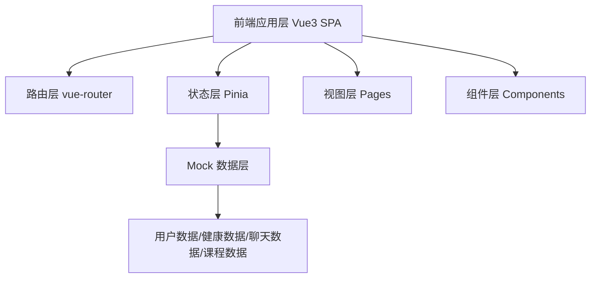

# 技术架构文档 — 生命树 AI（LifeTree AI）

## 1. 架构设计

纯前端单页应用，所有数据通过前端 mock 提供，无后端服务。



## 2. 技术说明
- 前端：Vue 3.5 + TypeScript 5.6 + Vite 6 + Tailwind CSS 4
- 路由：vue-router 4（Hash 模式，适配静态部署）
- 状态管理：Pinia 3（管理用户信息、聊天消息、心情记录等跨页面状态）
- 图标：lucide-vue-next（Lucide 线性图标，对应原型 SVG 图标系统）
- 数据：前端 mock，集中管理于 `src/mock/` 目录
- 初始化工具：vite-init（vue-ts 模板）

## 3. 路由定义

| 路由路径 | 页面名称 | 说明 |
|----------|----------|------|
| / | 首页 | 问候、健康速览、今日规划、服务网格、陪伴入口 |
| /health | AI 健康 | 健康评分、生命体征、风险评估、用药提醒 |
| /companion | AI 陪伴 | 数字人、聊天、陪伴广场、心情记录 |
| /agent | 智能体 | 语音输入、演示对话、快捷功能、日程时间线 |
| /learn | 学习中心 | 分类、课程、老年课堂、直播、进度 |
| /profile | 个人中心 | 资料、家庭、菜单、模式切换、紧急联系 |

## 4. 目录结构

```
src/
├── assets/              # 静态资源（字体、图片）
├── components/          # 通用组件
│   ├── AppHeader.vue    # 顶部导航栏
│   ├── TabBar.vue       # 底部标签栏
│   ├── GlassCard.vue    # 毛玻璃卡片
│   └── SectionTitle.vue # 区块标题
├── composables/         # 组合式函数
│   └── useGreeting.ts   # 时段问候逻辑
├── mock/                # Mock 数据
│   ├── user.ts          # 用户/家庭数据
│   ├── health.ts        # 健康数据
│   ├── chat.ts          # 聊天数据
│   ├── course.ts        # 课程数据
│   └── schedule.ts      # 日程数据
├── pages/               # 页面组件
│   ├── Home.vue
│   ├── Health.vue
│   ├── Companion.vue
│   ├── Agent.vue
│   ├── Learn.vue
│   └── Profile.vue
├── stores/              # Pinia 状态
│   ├── user.ts          # 用户状态
│   └── chat.ts          # 聊天状态
├── styles/              # 全局样式
│   └── tokens.css       # 设计令牌（CSS 变量）
├── App.vue              # 根组件
├── main.ts              # 入口
└── router.ts            # 路由配置
```

## 5. 数据模型（Mock）

### 5.1 核心数据结构

```typescript
// 用户信息
interface UserProfile {
  name: string;          // 王秀兰
  id: string;            // LT20260001
  avatar: string;        // emoji 或图标
  healthScore: number;   // 86
  memberLevel: string;   // 黄金会员
}

// 健康指标
interface Vital {
  label: string;         // 心率
  value: string;         // 72
  unit: string;          // bpm
  trend: 'normal' | 'warning' | 'error';
}

// 聊天消息
interface ChatMessage {
  id: number;
  role: 'ai' | 'user';
  text: string;
  actions?: string[];    // AI 行动清单
}

// 日程项
interface ScheduleItem {
  time: string;          // 07:00
  emoji: string;
  desc: string;
  status: 'completed' | 'current' | 'upcoming';
}
```

## 6. 交互实现方案

| 交互 | 实现方式 |
|------|----------|
| Tab 导航 | vue-router 路由切换 + 激活态指示条 |
| SOS 按钮 | 点击弹出确认提示（mock） |
| 健康速览横滑 | CSS overflow-x scroll-snap |
| 健康评分环 | SVG stroke-dashoffset 动画 |
| 聊天发送 | Pinia 管理消息，模拟 AI 回复（延迟+预设回复） |
| 心情选择 | 单选高亮，Pinia 记录 |
| 麦克风动画 | CSS conic-gradient 旋转 + 脉冲扩散 keyframes |
| 用药开关 | v-model 双向绑定 |
| 模式切换 | 单选高亮，Pinia 记录 |
| 课程学习 | 点击 mock 提示 |
